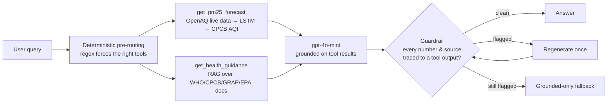

# Delhi PM2.5 Air-Quality Agent

An agentic air-quality assistant for **Delhi PM₂.₅**: it forecasts pollution with a
trained **LSTM**, answers regulatory questions ("is this worse than WHO's safe
level?", "does next week trigger GRAP restrictions?") from a **RAG knowledge base
of official documents**, and is built to **not make things up** — every number and
citation in an answer is checked against its sources before it ships.

It started as a univariate LSTM forecasting study and grew into a small,
production-shaped system: deterministic tool-routing, code-computed air-quality
indices, a post-generation grounding guardrail, a CI-gated evaluation harness,
tracing, an HTTP API, and a free-tier deployment path.

---

## What it does



- **Forecasting** — a 30-day-lookback LSTM predicts the next 1–30 days of PM₂.₅
  (µg/m³), converted to the **CPCB Air Quality Index** category in code.
- **Regulatory Q&A** — a retrieval layer over four official PDFs (WHO 2021 Global
  Air Quality Guidelines, CPCB National AQI, Delhi GRAP schedule, US EPA PM NAAQS)
  answers standards questions with citations.
- **Grounding** — the agent computes AQI itself (never lets the model map µg/m³ to
  a category), injects the hard-to-retrieve WHO numeric thresholds directly, and
  runs a **provenance guardrail** on every reply.

---

## Key engineering ideas

These are the parts worth reading the code for:

| Idea | Where | Why |
|---|---|---|
| **Deterministic pre-routing** | `src/agent.py` | Regex detects standards/forecast intent and *force-calls* the right tool before the LLM sees the query — a floor under tool-use, not a prompt suggestion. |
| **AQI computed in code** | `src/aqi.py` | The LSTM outputs µg/m³; CPCB categories are a piecewise rescaling. Reading µg/m³ against index ranges silently understates severity, so the mapping is never left to the model. |
| **Hardcoded WHO thresholds** | `src/rag/retrieval.py` | The WHO guideline table is a number-dense chunk MiniLM ranks poorly; the values (5 µg/m³ annual, 15 µg/m³ 24-hour) are injected directly rather than chased through retrieval tuning. |
| **Post-generation guardrail** | `src/guardrail.py` | Checks the *provenance* of every number and named source in a reply against that turn's tool outputs. Flagged → regenerate once → grounded-only fallback. Never ships an unsupported claim. |
| **Eval harness + CI gates** | `eval/`, `tests/` | 14 cases (guardrail, routing, retrieval, end-to-end) plus a forecast-vs-persistence benchmark, with hard thresholds that block merges. |
| **Observability** | `src/observability.py` | Per-tool spans, token usage/cost, and the guardrail verdict — captured locally and mirrored to Langfuse when configured. |

---

## Repository layout

```
src/
  agent.py          # orchestration: pre-routing, tool loop, guardrail-gated answer()
  aqi.py            # CPCB µg/m³ → AQI sub-index / category
  forecasting.py    # LSTM load + iterative forecast
  fetch_data.py     # OpenAQ v3 live 30-day history
  guardrail.py      # verify_response provenance check + fallback
  observability.py  # tracing (local + Langfuse)
  api.py            # FastAPI: /query, /forecast, /health
  app.py            # Streamlit UI (talks to the API over HTTP only)
  rag/
    ingest.py       # PDF → chunk → embed → Chroma
    retrieval.py    # stage/source-aware retrieval + WHO constant injection
eval/
  run_eval.py       # runs every case, writes report.{json,md}
tests/
  eval_cases.yaml   # the eval suite
  test_eval_gates.py# pytest CI gate (key-free tier + report-backed thresholds)
models/             # best_lstm.keras, scaler.joblib
data/
  processed/        # daily PM2.5 CSVs
  chroma_db/        # prebuilt vector store
  knowledge_base/   # the four source PDFs
Dockerfile, docker-compose.yml, DEPLOY.md   # deployment
.github/workflows/  # ci.yml, docker.yml
```

---

## Quickstart (local)

```bash
git clone https://github.com/ashlanserrao/air-quality-forecast.git
cd air-quality-forecast

python -m venv .venv
source .venv/bin/activate        # Windows: .venv\Scripts\activate
pip install -r requirements.txt
```

Set your keys (a `src/.env` file works, or export them):

```bash
export OPENAI_API_KEY=sk-...     # required for /query (the agent)
export OPENAQ_API_KEY=...        # required for live forecasts
# optional tracing:
# export LANGFUSE_PUBLIC_KEY=... LANGFUSE_SECRET_KEY=... LANGFUSE_HOST=https://cloud.langfuse.com
```

Run the API and the UI in two terminals:

```bash
# terminal 1 — API (from src/, so `import agent` resolves)
cd src && uvicorn api:app --reload --port 8000

# terminal 2 — Streamlit UI (calls the API over HTTP)
API_URL=http://localhost:8000 streamlit run src/app.py
```

Ask the agent directly from the CLI without the UI:

```bash
python src/agent.py "is Delhi's air worse than what WHO considers safe?"
```

The vector store in `data/chroma_db/` is prebuilt. To rebuild it from the PDFs:
`python src/rag/ingest.py`.

---

## The forecasting model (with an honest caveat)

- **Architecture**: univariate LSTM, 30-day lookback → next-day PM₂.₅, Adam / MSE.
- **Data**: OpenAQ v3, New Delhi (location 8118), daily-aggregated PM₂.₅, 2016–2024.
- **Split**: 80/20 chronological (the last 20% is never seen in training).

Held-out performance, and the same numbers reproduced by the eval harness:

| Metric | LSTM | Persistence ("tomorrow = today") |
|---|---|---|
| MAE  | **19.24 µg/m³** | 19.39 µg/m³ |
| RMSE | **31.09 µg/m³** | 33.14 µg/m³ |

**Read this honestly:** the LSTM only *barely* beats a naive persistence baseline on
MAE (~1%). Its real edge is on RMSE (~6%) — it avoids large errors better, but on a
typical day it's close to "assume tomorrow equals today." The eval harness reports
this every run rather than hiding it, and the CI gate requires the model to at least
beat persistence.

---

## Evaluation & CI

`eval/run_eval.py` runs the full suite and writes `eval/report.{json,md}`:

```bash
python eval/run_eval.py          # live agent + forecast benchmark
pytest tests/ -q                 # gate: guardrail cases (key-free) + report thresholds
```

Metrics are **in-house and deterministic** (no RAGAS): faithfulness = the guardrail
provenance check on end-to-end answers; context-relevance = query↔chunk cosine
(reported, with a floor + drift baselines); plus routing accuracy and the forecast
benchmark. **Hard gates** (block merge): all guardrail regression cases pass, routing
100%, retrieval accuracy 100%, answers grounded, and LSTM MAE ≤ persistence MAE.

The **`ci.yml`** workflow runs lint + the key-free test tier on every PR (always), and
runs the full eval + threshold enforcement **only when an `OPENAI_API_KEY` secret is
present** — forks without the key skip that job gracefully instead of failing.

---

## Observability

Every `agent.answer()` builds a span tree — per-tool input/output/latency, the nested
live-data fetch, LLM token usage + estimated cost, and the guardrail verdict. It's
captured locally (inspect with `python scripts/demo_trace.py`) and mirrored to
**Langfuse** when `LANGFUSE_*` env vars are set. Tracing never breaks a request:
Langfuse calls are defensive and degrade to local-only.

---

## Deployment (free tier)

The stack (TensorFlow + Torch + Chroma) needs ~1.5–2.5 GB RAM, so 512 MB free tiers
won't hold it. The documented path is **Oracle Cloud Always Free** (an arm64 Ampere A1
VM, 12 GB RAM, genuinely no charge). CI builds an **arm64** image and pushes it to
GHCR on merge to `main`; the VM pulls and runs it via `docker-compose` (a heavy `api`
service + a light Streamlit `ui`). Full step-by-step, including the two Oracle
firewalls people always miss — see **[DEPLOY.md](DEPLOY.md)**.

---

## API reference

| Method | Path | Body | Notes |
|---|---|---|---|
| `GET`  | `/health`   | — | Liveness + which keys are configured. No key needed. |
| `POST` | `/forecast` | `{ "history": [float ≥30], "horizon": 1–30 }` | LSTM forecast + AQI. No key needed. |
| `POST` | `/query`    | `{ "query": "..." }` | Full agent answer. Needs `OPENAI_API_KEY`. |

---

## Future work

- Multivariate model (temperature, RH, wind) — the univariate LSTM's thin margin over
  persistence suggests meteorology is where accuracy gains are.
- Convert LSTM → TFLite and embeddings → ONNX to shrink the runtime under 1 GB and
  widen free-hosting options.
- Expand the knowledge base and eval suite as new regulatory documents are added.
